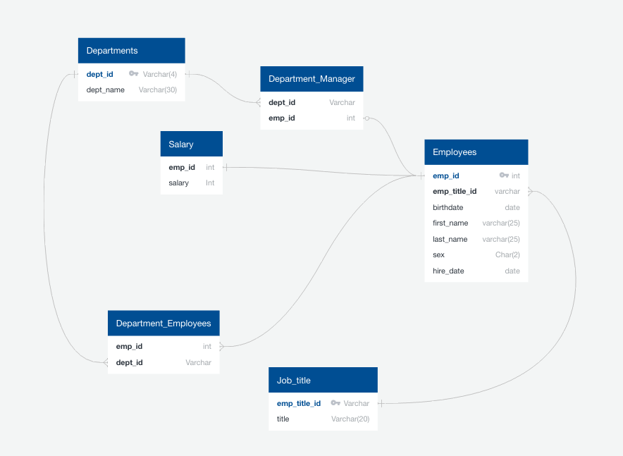
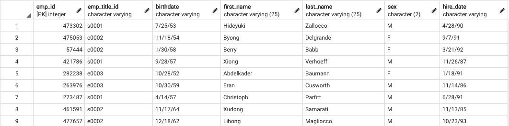
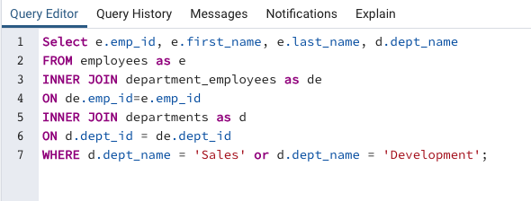
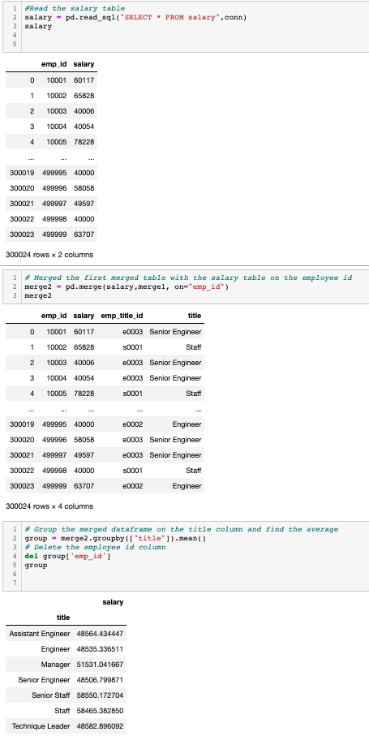
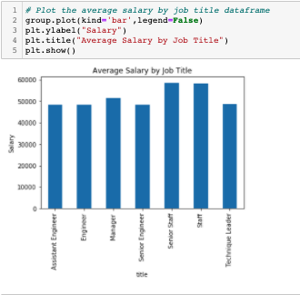

# SQL_challenge

## What is stored in this repository? 
This repo holds a project where I conducted both Data Engineering/Data Modeling and Data Analysis. I was given six csv files located in "data/" which contained information about a company and their employees. My job was to create the relational database in pgAdmin4, store the data in said database, query the data for analysis using PostgreSQL, and continue analyses using Jupyter notebooks, Python, Pandas, Matplotlib, and SQLAlchemy, 

## How to run the code:
1. Clone the repository to your machine. 
2. Open PgAdmin4.
3. Create a new database called "employees_db".
4. Open the query editor for the database you just created.
5. Copy and paste the code from lines [:46] the "query.sql" file. Run copied code in the query editor to create the tables for the database.
6. For each table, import the corresponding csv file in this order: titles, employees, salaries, departments, dept_emp, dept_manager
7. Clear out the query edior.
8. Copy and paste the code from lines [46:] the "query.sql" file. Run each query one at a time to view each report.
9. Open your terminal.
10. 'cd' into the directory the files were saved in in.
11. Run the command "jupyter notebook". This will open the folder in a Jupyter Notebook.
12. Open the "analysis.ipynb" file in the Jupyter Notebook.
13. At the top, under the "Kernal" tab, click "Restart & Run All". This will run all the cells on the page and display all the visualizations.

## The Database Structure:

## An example table in pgAdmin: 

## An example PostgreSQL query: 

## An example of a SQLAlchemy query and Pandas merging

## Matplotlib Visualization

